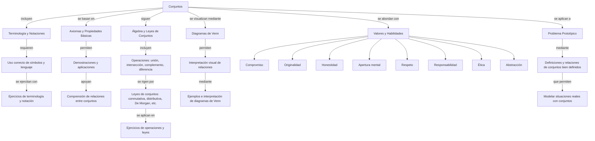

```mermaid
graph TD
  A[Conjuntos] -->|incluyen| B[Terminología y Notaciones]
  A -->|se basan en| C[Axiomas y Propiedades Básicas]
  A -->|siguen| D[Álgebra y Leyes de Conjuntos]
  A -->|se visualizan mediante| E[Diagramas de Venn]

  B -->|requieren| F[Uso correcto de símbolos y lenguaje]
  F -->|se ejercitan con| G[Ejercicios de terminología y notación]

  C -->|permiten| H[Demostraciones y aplicaciones]
  H -->|apoyan| I[Comprensión de relaciones entre conjuntos]

  D -->|incluyen| J[Operaciones: unión, intersección, complemento, diferencia]
  J -->|se rigen por| K[Leyes de conjuntos: conmutativa, distributiva, De Morgan, etc.]
  K -->|se aplican en| L[Ejercicios de operaciones y leyes]

  E -->|permiten| M[Interpretación visual de relaciones]
  M -->|mediante| N[Ejemplos e interpretación de diagramas de Venn]

  A -->|se abordan con| O[Valores y Habilidades]
  O --> P[Compromiso]
  O --> Q[Originalidad]
  O --> R[Honestidad]
  O --> S[Apertura mental]
  O --> T[Respeto]
  O --> U[Responsabilidad]
  O --> V[Ética]
  O --> W[Abstracción]

  A -->|se aplican a| X[Problema Prototípico]
  X -->|mediante| Y[Definiciones y relaciones de conjuntos bien definidos]
  Y -->|que permiten| Z[Modelar situaciones reales con conjuntos]
```
