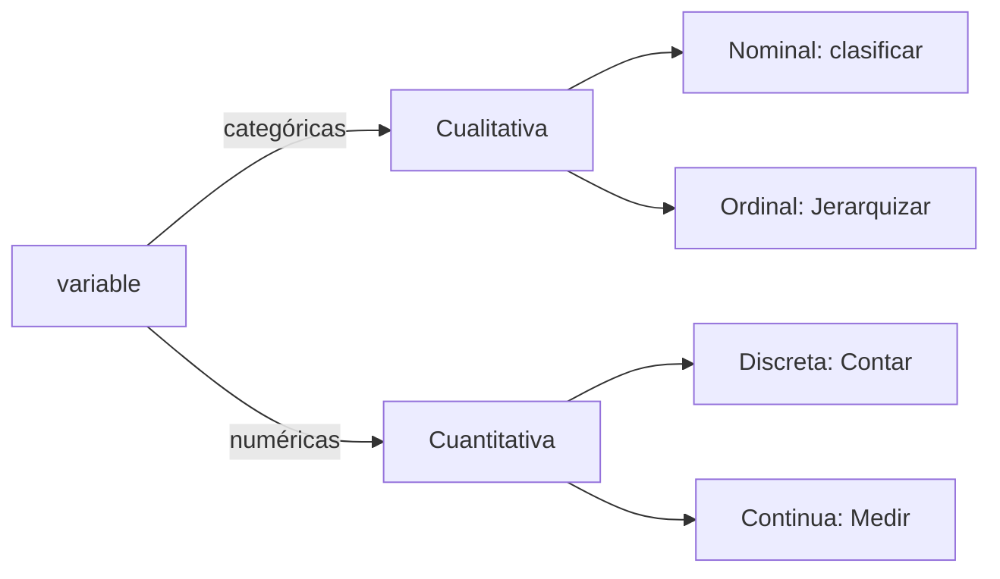

 
Que frustración siento hoy 
mi mamá ayer me dijo que recogiera, pero por el hecho de que le molesta que nadie haga nada, pero no es capaz de decirme que quiere que lo haga siempre, solo cuando a ella le molesta, y eso no está chido, por que me siento una máquina que no importa lo que estoy haciendo y no se preocupa por entender si lo hago por una razón como motivación para seguir en las cosas que hago por que no la tengo de ella o de mi papá por que soy diferente a ellos, y por eso asldkfjañslkdjjfñlkajsddflkñajsddflñkajs d dff-ljksadflñk jasdñlfjkh h me enoja que en verdad nunca se haya puesto a entenderme, por que ella es como es y yo no soy más que su consuelo para que ella no se sioenta sola por quecuando yo me sentyío solo no lñeo oimp´roitó jasdflñkaljkñhsdsdgfl ljkñh khu bjk y no le importya es como si no le preocupara yo mno soy su marido no psoy quien se va a quedar en  dsui estyómago, yo soy yoi y byop puedo spendsar y sentoir y quietro sentir y sien t6o m ucho inclu7so m ás ued ell la ¿peroi a ella no ele importa no le iomporta no le importo solo lel importa como se siente eela uy yo no soy ell la sdlkñ flkñajsdljkñnfflñajks ddfkjkjkslkñjdljkñ l k

No se si prefiero la incertidumbre o es que entendí que el mundo está lleno de ella, que la nombré para darle sentido a mi vida

Tipos de variables estadísticas

